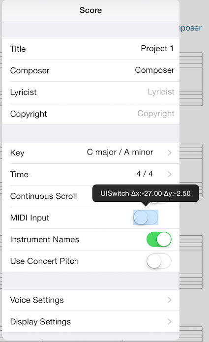

# ContainerViewAdjustableContentLayout
If your view layout is done programmatically, this class will help overcome difficulties in view debugging and inefficiency in achieving a precise (sub)view layout. Specifying ContainerViewAdjustableContentLayout as your superclass for containers allows layout debugging and free adjustability of an arbitrary subview's arrangement during runtime through simple drag gestures. 

Example screen on iPad using simple wrapper around UITableViewCell contentView:

